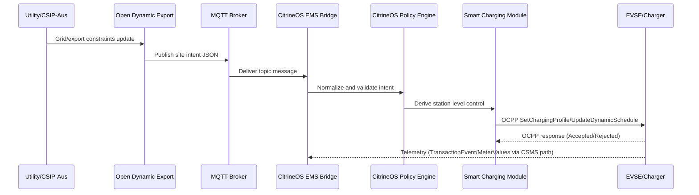

# MQTT Setup Guide: CSIP-Aus -> CitrineOS -> EV

This guide explains how to set up MQTT so CSIP-Aus signals (via Open Dynamic Export) flow into CitrineOS, then into charger-level OCPP control for EV charging/discharging behavior.

Audience:

1. Operators who are new to MQTT
2. Developers validating end-to-end EMS intent ingestion

Companion docs:

1. [Docs Home](./index.md)
2. [Deployment Guide (Beginner-Friendly)](./deployment-guide.md)
3. [Quick Start (10 Minutes)](./quick-start.md)
4. [Production Runbook](./production-runbook.md)
5. [ODE E2E Validation](./testing-ode-e2e.md)

---

## 1) High-Level Flow

```mermaid
flowchart LR
    A[CSIP-Aus Signals\n(DNSP / Market Constraints)] --> B[Open Dynamic Export\n(Home Assistant Add-on)]
    B --> C[MQTT Broker\nTopic: citrine/ems/site/+/intent/current]
    C --> D[CitrineOS EMS MQTT Bridge]
    D --> E[CitrineOS Policy + Smart Charging]
    E --> F[OCPP 2.1 Commands\nSetChargingProfile / UpdateDynamicSchedule]
    F --> G[EVSE / Charger]
    G --> H[EV Charging or V2X Discharging]

    G --> I[Telemetry\nTransactionEvent / MeterValues]
    I --> D
```

What this means in plain language:

1. CSIP-Aus constraints are produced by the utility/grid ecosystem.
2. Open Dynamic Export interprets those constraints.
3. Open Dynamic Export (or Home Assistant automations) publishes a site-intent message to MQTT.
4. CitrineOS subscribes to that MQTT topic and stores/applies the intent.
5. CitrineOS maps site-level limits into station-level OCPP controls.
6. Chargers enforce the command and report telemetry back.

---

## 2) Required Components

You need all of the following reachable on the network:

1. Home Assistant (with Open Dynamic Export add-on)
2. MQTT broker (for example Mosquitto)
3. CitrineOS core service with EMS module enabled
4. At least one online charger in CitrineOS

---

## 3) MQTT Topic and Payload Contract

Recommended topic:

1. `citrine/ems/site/<siteId>/intent/current`

Testing has been undertaken using [Open Dynamic Export](https://github.com/longzheng/open-dynamic-export). The `publish` segment can be added to the `config.yaml` file to publish CSIP-Aus commands to Citrine:

```json
"publish": {
      "mqtt": {
        "host": "mqtt://example",
        "username": "username",
        "password": "password",
        "topic": "citrine/ems/site/SITE/intent/current"
      }
    }
```

Configured wildcard on CitrineOS side:

1. `citrine/ems/site/+/intent/current`

Minimal compatible payload (ODE-style envelope):

```json
{
  "timestamp": "2026-08-19T07:00:00Z",
  "constraints": {
    "importLimitW": 25000,
    "exportLimitW": 5000,
    "evBudgetW": 11000,
    "dischargeBudgetW": 7000,
    "rampRateWPerSec": 1000
  },
  "operationMode": "ExternalLimits",
  "reason": "ode_live_dynamic_export",
  "flags": {
    "allowDischarge": true,
    "emergencyCurtailment": false
  },
  "metadata": {
    "source": "open-dynamic-export"
  }
}
```

Notes:

1. `siteId` may be omitted in payload if it is encoded in the topic.
2. `messageId` may be omitted (CitrineOS can generate one).
3. `expiresAt` may be omitted (CitrineOS can default to short TTL).

---

## 4) Configure CitrineOS EMS MQTT Bridge

Set these config values for EMS MQTT:

1. `modules.ems.mqtt.enabled=true`
2. `modules.ems.mqtt.brokerUrl=<mqtt-url>`
3. `modules.ems.mqtt.siteIntentsTopic=citrine/ems/site/+/intent/current`

Optional but recommended:

1. `modules.ems.mqtt.startupMode=non_fatal`
2. `modules.ems.mqtt.eventAckTopicTemplate=citrine/ems/site/<siteId>/event/ack`
3. `modules.ems.mqtt.eventRejectTopicTemplate=citrine/ems/site/<siteId>/event/reject`

Broker URL examples:

1. `mqtt://127.0.0.1:1883`
2. `mqtt://mqtt-broker.local:1883`
3. `mqtts://mqtt.example.com:8883`

If your broker requires auth/TLS:

1. Set the appropriate username/password/certificate values in CitrineOS config.
2. Confirm network/firewall access from CitrineOS host to broker port.

---

## 5) Broker Setup Example (Mosquitto via Docker)

If you do not already have a broker:

```powershell
docker run -d --name mosquitto -p 1883:1883 eclipse-mosquitto:2
```

Quick health check:

```powershell
docker ps --filter "name=mosquitto"
```

For production:

1. Use persistent config and data volumes.
2. Enable authentication.
3. Prefer TLS for non-local traffic.

---

## 6) Start and Verify the Bridge

Use CitrineOS EMS endpoints:

1. `GET /data/ems/emsMqttBridge`
2. `POST /data/ems/emsMqttBridge`
3. `GET /data/ems/emsMqttBridge`

Expected state after start:

1. `enabled=true`
2. `started=true`

---

## 7) End-to-End Test Procedure

## 7.1 Subscribe to Observe Incoming Intents

Use MQTT client (example with Mosquitto tools):

```powershell
mosquitto_sub -h 127.0.0.1 -p 1883 -t "citrine/ems/site/+/intent/current" -v
```

## 7.2 Publish a Test Intent

```powershell
mosquitto_pub -h 127.0.0.1 -p 1883 -t "citrine/ems/site/au-site-001/intent/current" -m "{\"timestamp\":\"2026-08-19T07:00:00Z\",\"constraints\":{\"importLimitW\":25000,\"exportLimitW\":5000,\"evBudgetW\":11000,\"dischargeBudgetW\":7000,\"rampRateWPerSec\":1000},\"operationMode\":\"ExternalLimits\",\"reason\":\"ode_live_dynamic_export\",\"flags\":{\"allowDischarge\":true,\"emergencyCurtailment\":false},\"metadata\":{\"source\":\"open-dynamic-export\"}}"
```

## 7.3 Verify CitrineOS Ingested It

1. `GET /data/ems/emsSiteIntent?tenantId=1&siteId=au-site-001&currentOnly=true`
2. `GET /data/ems/emsIntakeTelemetry?tenantId=1&siteId=au-site-001&limit=50`

Expected:

1. Current intent exists for `au-site-001`
2. `accepted` count increments

## 7.4 Derive and Apply Plan

Derive:

1. `POST /data/ems/emsChargingPlan?tenantId=1`

Apply:

1. `PUT /data/ems/emsChargingPlan?tenantId=1`

Example body:

```json
{
  "siteId": "au-site-001",
  "stationIds": ["10919352"],
  "evseId": 1,
  "strategy": "equal_share_online",
  "chargingProfilePurpose": "ChargingStationMaxProfile",
  "operationMode": "ExternalLimits"
}
```

Expected:

1. Derive returns recommendations
2. Apply returns `appliedCount >= 1` for eligible online stations

---

## 8) Validation in Operator UI

After intent publish and apply:

1. Open EMS/Operations views
2. Confirm live intent details update
3. Open station Operations tab
4. Confirm profile actions work (dynamic update / set profile)
5. Confirm Active Profiles tab can refresh with Get Charging Profiles button

---

## 9) Troubleshooting

## 9.1 Bridge Not Starting

Checks:

1. Broker URL correct and reachable
2. Broker port open from CitrineOS host
3. Credentials valid
4. TLS cert chain valid (for `mqtts://`)

## 9.2 Message Published But Not Ingested

Checks:

1. Topic matches wildcard exactly (`citrine/ems/site/+/intent/current`)
2. Payload JSON is valid
3. Timestamps are not stale/expired
4. CitrineOS logs for reject reason

## 9.3 Intents Ingested But No Charger Action

Checks:

1. Station is online
2. Station protocol and capability allow requested behavior
3. Plan derive/apply endpoints return success
4. No validation errors in OCPP requests

## 9.4 Old UI Behavior After Successful Deploy

Checks:

1. Confirm correct image tag in running container
2. Hard refresh browser (`Ctrl+F5`)
3. Verify page chunk markers if needed

---

## 10) Security and Operational Notes

1. Do not expose broker anonymously on public networks.
2. Use credentials and TLS in production.
3. Rotate tokens/credentials immediately if exposed.
4. Log every release with image tags and digests.
5. Keep MQTT topic contract stable once automations depend on it.

---

## 11) Additional Diagram: Message Sequence



---

## 12) Review Checklist Before Production Enablement

1. Broker HA/backup strategy documented
2. Topic namespace finalized
3. Intent payload schema versioned
4. Citrine bridge health endpoint monitored
5. Rollback path tested with known-good image tags
